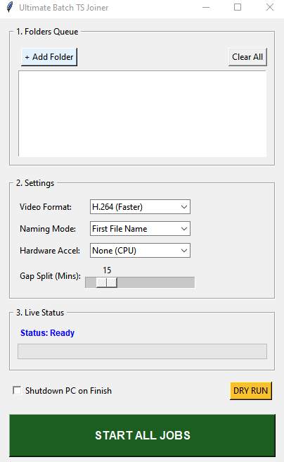

# 🎬 Ultimate Batch TS Joiner (v1.1.0)


A powerful, automated GUI tool to join fragmented `.ts` video segments into high-quality `.mp4` files. Designed for speed, ease of use, and massive batch processing.

---


---

## ✨ Key Features

- 🤖 **Smart Auto-Split:** Automatically detects time gaps (e.g., 15 mins) between files to split one folder into multiple logical video parts.
- ⚡ **Hardware Acceleration:** Full support for **NVIDIA (NVENC)**, **AMD (AMF)**, and **Intel (QuickSync)** GPUs.
- 📦 **Batch Queue:** Drag in dozens of folders and let the app process them all unattended.
- 🎞️ **Dual Codec Support:** Toggle between **H.264** (Maximum Speed) and **H.265** (Maximum Compression).
- 📝 **Flexible Naming:** Choose to name output files based on the **First TS File** in the sequence or the **Parent Folder Name**.
- 🛠️ **Dry Run Mode:** Instantly calculate total size and estimate output space before starting.
- 🌙 **Auto-Shutdown:** Option to shut down your PC automatically once the entire queue is finished.

---

## 🛠️ Installation & Setup

### 1. The "Engine" (FFmpeg)
This application requires **FFmpeg** to perform the video magic. 
1. Download the latest "Essentials" build from [gyan.dev](https://www.gyan.dev/ffmpeg/builds/).
2. Extract the `.7z` file and find `ffmpeg.exe` and `ffprobe.exe` inside the `bin` folder.
3. **Important:** Place both `.exe` files in the same folder as this application.

### 2. Running the App
- **For Users:** Download the latest `Ultimate_TS_Joiner.exe` from the [Releases](https://github.com/Kikanju/Ultimate-TS-Joiner/releases) page.
- **For Developers:** ```bash
  git clone [https://github.com/Kikanju/Ultimate-TS-Joiner.git](https://github.com/Kikanju/Ultimate-TS-Joiner.git)
  python ultimate_joiner.py  
